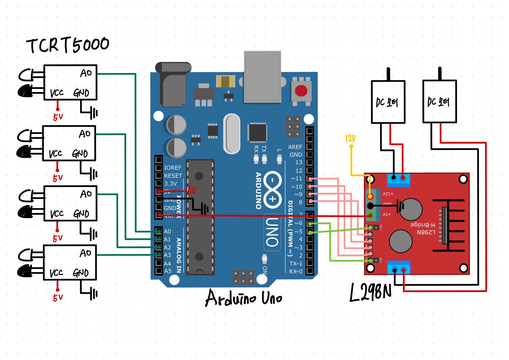
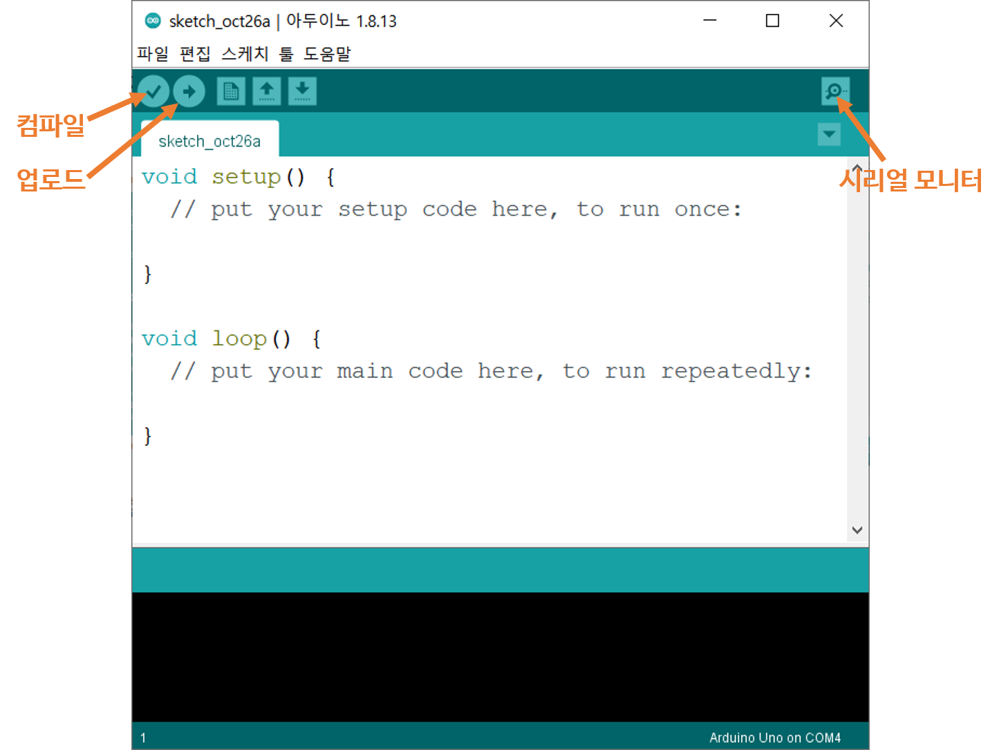

# Week 1

## 라인트레이서를 시작하기 전에

라인트레이서란 정해진 라인을 보고 따라가는 로봇이다. 사람이 직접 로봇을 조작하는 것이 아닌, 라인을 스스로 보고 주행하기 때문에 여러 분야에서 사용될 수 있다.


물류 창고에서 바닥에 그려진 라인을 따라 물건을 운반하는데 사용하거나 단거리 자율주행 자동차의 구현체가 될 수 있다. 이러한 라인트레이서를 만들기 위해 MCU를 사용하여 주변 하드웨어를 제어해야 하는데 처음 고성능 MCU를 접하기에는 여러 어려움이 존재한다.  MCU 개발 보드 자체의 가격이 비쌀 뿐만 아니라 개발 환경을 구축하기 위해 여러 수고로움이 있기 때문이다. 그래서 나온 것이 아두이노. 아두이노는 가격이 저렴하고 개발 환경을 구축하기가 정말 쉽다. 아두이노 IDE를 설치하고 아두이노랑 컴퓨터를 USB와 연결해주기만 하면 개발 환경 구축 끝. 또한 아두이노를 위한 센서나 드라이버 모듈들이 잘 나와있기 때문에 본인이 상상하는 여러 로봇의 프로토타입을 쉽고 빠르게 개발할 수 있다.


## 라인트레이서의 구성요소

### 센서 (인식)

바닥에 그려진 라인을 인식하기 위해서 수광 및 발광 센서를 사용한다.


우리가 사용하는 센서 사진 첨부 그리고 그 특징 (+센서가 필요한 이유)

### 프로세서 (처리)

우리가 사용하는 프로세서 사진 첨부 그리고 그 특징 (+프로세서가 필요한 이유) 아두이노 핀에 대한 설명

### 모터 (제어)

우리가 사용하는 모터와 모터드라이버 사진 첨부 그리고 그 특징 (+모터 드라이버가 필요한 이유)


## 본체 조립

먼저, 본체를 다음 동영상을 따라하여 조립한다.

(동영상)


## 브레드보드 회로 구성 및 탐구



### 전기의 기본

### 노드 개념

전원, 소자,

브렌치: 소자

노드: 브렌치와 브렌치 사이. 소자를 지나지 않고 갈 수 있는 길

https://m.blog.naver.com/PostView.nhn?blogId=gommy313&logNo=220894737323&proxyReferer=https:%2F%2Fwww.google.com%2F

### 브레드보드

우리는 5V를 각종 부품에 공급해주어야 한다. 하지만 아두이노에 나오는 5V 핀과 GND 핀은 그렇게 많지 않다. 그래서 우리는 5V 노드를 여러 갈래로 나누어야 하는데, 이를 도와주는 것이 브레드보드이다. 브레드보드의 각 구멍들은 금속 클립으로 한 노드로 연결되게 만들어준다. 브레드 보드에는 버스 영역과 IC 영역이 있는데 이 영역들은 다음 사진과 같다.


### 회로 연결하기

브레드 보드를 이용하여 직접 연결해보자. 완성된 모습은 다음과 같다.


## 테스트 코드 넣기

[테스트 코드](./src/test_code/test_code.ino)

### 개발환경 구축


https://www.arduino.cc/en/Main/Software



### 테스트 코드

제대로 잘 동작 하나요?

(코드 링크)


## setup, loop 함수

(예제) 헤어나올 수 없는 루프속으로


## digitalWrite, digitalRead, delay 함수

(예제) 부저를 일정 주기마다 소리내기.

(예제) 스위치의 매력에 빠져보아요.

(딜레이)

```cpp
// 1. 상단 메뉴에서 아두이노를 컴퓨터에 연결한다.
// 2. 툴>포트>COM4 (Arduino Uno)선택    (COM5, COM6일 수도 있음)
// 3. 아래 내용 작성

void setup() {        //초기설정
  Serial.begin(9600); //통신속도 설정
}

void loop() {                     //초기설정 후 반복실행
  Serial.println("Hello World!"); //헬로 월드 출력
  delay(1000);                    //1000ms == 1초 쉬어가기
}

// 4. 상단 메뉴에서 파일>저장 혹은 Ctrl+S로 파일 저장, 파일명은 HelloWorld
// 5. 상단 아이콘에서 화살표 아이콘을 눌러 업로드한다.
// 6. 업로드 완료되면 우측상단에서 돋보기 아이콘을 눌러 시리얼 모니터를 누른다.
// 7. 시리얼 모니터 새 창이 뜨며 매 1초마다 Hello World!가 뜬다.
```


## 조건문 (if문)

(예제) 스위치와 부저를 이용해 피아노 만들기


## 반복문 (for문)

(예제) ?


