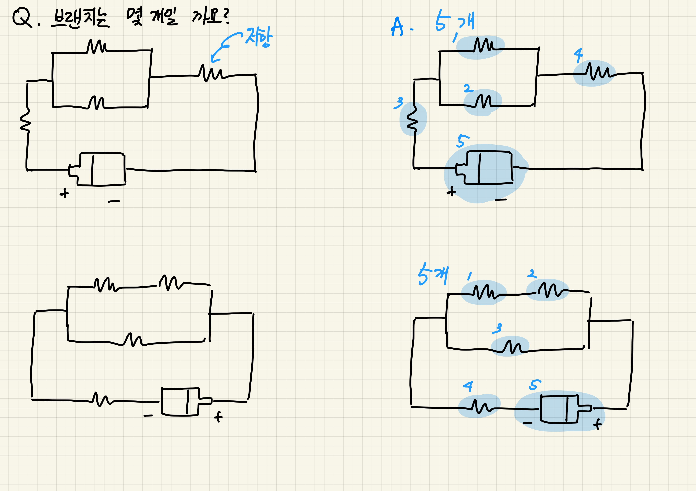
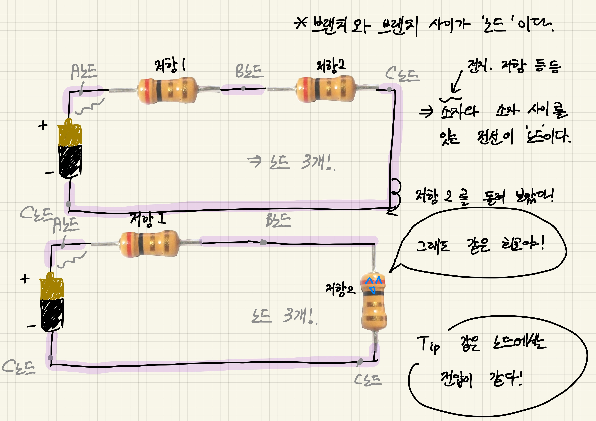

# Week 1

## 라인트레이서를 시작하기 전에

라인트레이서란 정해진 라인을 보고 따라가는 로봇이다. 사람이 직접 로봇을 조작하는 것이 아닌, 라인을 스스로 보고 주행하기 때문에 여러 분야에서 사용될 수 있다.


물류 창고에서 바닥에 그려진 라인을 따라 물건을 운반하는데 사용하거나 단거리 자율주행 자동차의 구현체가 될 수 있다. 이러한 라인트레이서를 만들기 위해 MCU를 사용하여 주변 하드웨어를 제어해야 하는데 처음 고성능 MCU를 접하기에는 여러 어려움이 존재한다.  MCU 개발 보드 자체의 가격이 비쌀 뿐만 아니라 개발 환경을 구축하기 위해 여러 수고로움이 있기 때문이다. 그래서 나온 것이 아두이노. 아두이노는 가격이 저렴하고 개발 환경을 구축하기가 정말 쉽다. 아두이노 IDE를 설치하고 아두이노랑 컴퓨터를 USB와 연결해주기만 하면 개발 환경 구축 끝. 또한 아두이노를 위한 센서나 드라이버 모듈들이 잘 나와있기 때문에 본인이 상상하는 여러 로봇의 프로토타입을 쉽고 빠르게 개발할 수 있다.


## 라인트레이서의 구성요소

### 센서 (인식)

바닥에 그려진 라인을 인식하기 위해서 수광 및 발광 센서를 사용한다. 둘 다 사람 눈에 보이지 않는 적외선 영역을 이용한다. 발광 센서가 적외선을 발생시키고 바닥에 얼마나 반사되는지를 수광 센서가 측정한다. 일반적으로 어두운 영역에서는 빛을 흡수하기 때문에 수광 센서에 들어오는 값이 작다. 반면에 밝은 영역에서는 빛을 반사하기 때문에 수광 센서에 들어오는 값이 크다. 우리는 IR 수광 센서와 발광 센서가 하나의 세트로 된 TCRT5000 모듈을 사용한다.

(모듈과 TRCT5000 단품 사진, 핀이 강조되었으면 좋겠음)

TCRT5000 센서를 그대로 사용하면 외부 주변 회로(저항 등)들을 달아주어야 하는데, 주변 회로가 이미 구성되어 있는 모듈을 이용하면 편하다. TCRT5000 모듈에는 총 4개의 핀과 가변 저항 하나가 존재하는데, AO(Analog Output) 핀을 통해 수광 센서가 얼마나 빛을 감지했는지 알 수 있다. 그리고 VCC핀과 GND핀이 있다. 나머지 핀 하나는 DO(Digital Output)으로 일정 수치 이상으로 빛을 감지하면 이 핀에서 디지털 신호 1을 출력하고 그렇지 않으면 0을 출력한다. 일정 수치는 모듈의 가변 저항으로 조절이 가능하다. 우리는 연속적인 값이 필요하므로 DO 핀을 이용하지 않고 AO 핀만 이용한다. (참고로 이 모듈은 밝은 영역에서는 AO가 낮은값, 어두운 영역에서는 높은 값을 출력한다. 내부 회로문제?)

### 프로세서 (처리)

아두이노는 다음과 같이 생겼다.

(디지털 핀과 아날로그 핀 소개 및 5V, GND, VIN 소개)

라인트레이서를 구현하기 위해 총 4단계의 과정을 거쳐야 한다. 첫 번째 과정으로 아날로그 신호를 디지털 신호로 변환하는 과정이 필요하다. 연속적인 아날로그 신호를 디지털 기기에서 처리할 수 없으므로 아날로그 신호를 0에서 1023사이의 정수로 변환하는 과정을 거쳐야 한다. 그렇게해서 비로소 데이터를 처리할 수 있는 상태가 된다.

두 번째 과정으로 디지털로 변환된 센서의 값을 보정하는 과정이 필요하다. 센서의 자잘한 노이즈를 없애기 위해 비트 쉬프트 과정을 거치고 각 센서마다 특성이 상이하기 때문에 이 센서의 값을 보정해야 하는 과정을 거처야 한다. 이때 센서의 특성이란 각 센서가 동일한 세기의 빛을 감지했을 때의 수치를 말한다.

세 번째 과정으로 보정된 센서 값을 통해 바퀴의 조향 정도를 정해주는 position을 구한다. position을 구할 때에는 각 센서의 가중합으로 구하게 되는데 자세한 내용은 ~주차에 설명한다.

네 번째 과정으로 PWM으로 모터를 동작시킨다.

이 모든 과정을 아두이노의 ATMega328P(확인 필요) 프로세서로 처리할 수 있다.

### 모터 (제어)

모터를 구동하는데에는 높은 전압이 필요하다. 하지만 아두이노에는 높은 전압을 발생시킬 수 없기 때문에 작은 전압으로도 높은 전압을 제어할 수 있는 모터 드라이버가 필요하다. 모터 드라이버는 앞에서 설명한 대로 아두이노에서 신호를 받아 모터에 높은 전압을 인가시켜주는 역할을 해준다. 우리는 L298N이라는 모터 드라이버를 사용하는데 Dual-H Bridge를 탑재해 두 개의 DC 모터를 구동할 수 있으며 바퀴를 시계방향, 반시계방향으로 제어할 수 있다. H Bridge가 없었으면 모터를 일정한 방향으로만 구동해야 했다(물론, 앞으로만 가면 되기 때문에 이는 필요 없다.)

(모터 사진과 모터 드라이버 사진)


## 본체 조립

먼저, 본체를 다음 동영상을 따라하여 조립한다.

(동영상)


## 브레드보드 회로 구성 및 탐구


### 전기의 기본


### 브랜치, 노드 개념
전기회로를 브레드보드로 구현하기 위해 브랜치와 노드 개념을 익혀야 한다.
브랜치: 단순하게 말하면 회로의 각종 소자들이다. 전원(배터리), 저항 등이다.
노드: 브랜치와 브랜치(소자와 소자)를 잇는 연결부이다.






추가 참고: https://m.blog.naver.com/PostView.nhn?blogId=gommy313&logNo=220894737323&proxyReferer=https:%2F%2Fwww.google.com%2F

### 브레드보드

우리는 5V를 각종 부품에 공급해주어야 한다. 하지만 아두이노에 나오는 5V 핀과 GND 핀은 그렇게 많지 않다. 그래서 우리는 5V 노드를 여러 갈래로 나누어야 하는데, 이를 도와주는 것이 브레드보드이다. 브레드보드의 각 구멍들은 금속 클립으로 한 노드로 연결되게 만들어준다. 브레드 보드에는 버스 영역과 IC 영역이 있는데 이 영역들은 다음 사진과 같다.


### 회로 연결하기

브레드 보드를 이용하여 직접 연결해보자. 완성된 모습은 다음과 같다.


## 테스트 코드 넣기

[테스트 코드](./src/test_code/test_code.ino)

### 개발환경 구축


https://www.arduino.cc/en/Main/Software


## setup, loop 함수
Arduino Sketch에 들어가면 기본적으로 setup()함수와 loop()함수가 적혀 있다. 아두이노가 프로그램을 실행할 때 기본적으로 가지는 틀이다. 프로그램이 시작하면 setup함수를 한 번 실행하고 그 다음에 loop함수를 반복하여 실행한다. 따라서 setup함수 내에 프로그램이 잘 동작하기 위한 초기 설정들을 입력해 주고, loop에는 주요 내용들을 입력하면 초기설정과 주요 내용을 구분하기 쉽다. 아래 예제를 보자.


(예제) 헤어나올 수 없는 루프속으로
```cpp
// 1. 상단 메뉴에서 아두이노를 컴퓨터에 연결한다.
// 2. 툴>포트>COM4 (Arduino Uno)선택    (COM5, COM6일 수도 있음)
// 3. 아래 내용 작성

void setup() {
  Serial.begin(9600);         // 초기설정: 통신속도설정
  Serial.println("setup!!");
}

int num=0;                    // 정수형 변수 num을 선언하고 0으로 초기화한다.
void loop() {
  Serial.print("loop~~~~~ ");
  Serial.println(num++);        // num의 값을 프린트하고, num에 1을 더해준다.
  delay(500);                 // 500ms = 0.5초 기다린다.
}
// 4. 상단 메뉴에서 파일>저장 혹은 Ctrl+S로 파일 저장
// 5. 상단 아이콘에서 화살표 아이콘을 눌러 업로드한다.
// 6. 업로드 완료되면 우측상단에서 돋보기 아이콘을 눌러 시리얼 모니터를 누른다.
// 7. 시리얼 모니터 새 창이 뜨며 매 1초마다 Hello World!가 뜬다.
```
```
출력:
setup!!
loop~~~~~ 0
loop~~~~~ 1
loop~~~~~ 2
loop~~~~~ 3
loop~~~~~ 4
...
```
setup!!은 처음에 한 번만 출력되고 loop~~~~ 숫자 는 계속 출력된다. setup함수가 처음에 한 번 실행되고 그 후에는 loop함수가 계속 실행됨을 알 수 있다.

더 해보기
- Serial.println(num++);를 Serial.println(num);로 바꿔본다
loop~~~~ 0이 반복해서 출력된다. num++을 해주지 않아서 num이 값이 증가하지 않고 계속 0으로 유지된다.
- Serial.println(num++);를 Serial.print(num++);로 바꿔본다
loop~~~~ 숫자 가 계속 출력된다. 숫자는 0부터 1씩 증가한다. 그러나 줄 나눔이 되지 않아서 loop~~~ 숫자가 한 줄에 이어서 출력된다.
- delay(500)을 delay(1000)으로 바꿔본다.
loop~~~~ 숫자 의 출력 주기가 1초가 된다. delay()함수는  입력 시간동안 기다린다. 단위는 ms단위이므로 delay(1000)은 매 loop마다 1초를 쉰다는 뜻이다.


## digitalWrite, digitalRead, delay 함수

(예제) 부저를 일정 주기마다 소리내기.

(예제) 스위치의 매력에 빠져보아요.


## 조건문 (if문)

(예제) 스위치와 부저를 이용해 피아노 만들기


## 반복문 (for문)

(예제) ?


